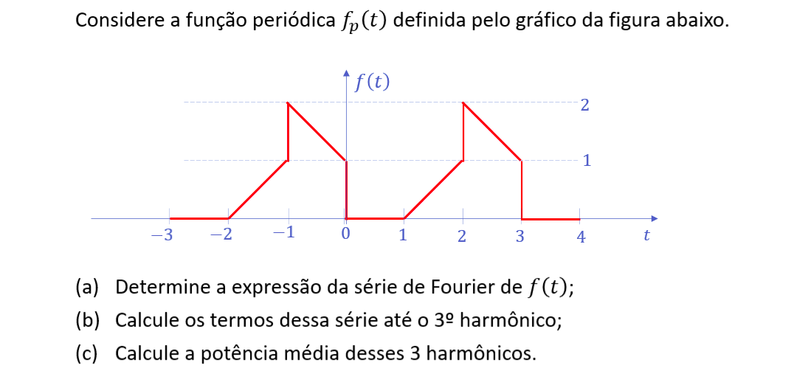

```{r setup, include=FALSE}
knitr::opts_chunk$set(echo = TRUE)
```



### Item (a)

Com período $T_0=3$, tem-se $\omega_0 = \frac{2\pi}{3}$ e a expressão da série de Fourier de $f(t)$ fica

\[
f(t) = a_0 + \sum_{n = -\infty}^{\infty} \bigg[a_n\cos(2\pi t/3) + b_n\sin(2\pi t/3)\bigg] 
\]

em que $a_0$, $a_n$ e $b_n$ são: (calculados pelo [Wolfram Alpha](https://www.wolframalpha.com/))

\begin{eqnarray}
a_0 & = & \frac{1}{3} \bigg[ \int_0^10dt + \int_1^2(t-1)dt + \int_2^3(4-t)dt\bigg] = \frac{1}{3} \bigg[ 0 + \frac{1}{2} + \frac{3}{2} \bigg] = {\frac{2}{3}}\\
 & & \\
a_n & = & \frac{2}{3} \bigg[ \int_0^10dt + \int_1^2(t-1)cos(n2\pi/3)dt + \int_2^3(4-t)cos(n2\pi/3)dt\bigg] = \\
    & = & {\frac{\sin(n\pi/3)}{\pi^2n^2}\bigg[3\sin(5n\pi/3) + 2n\pi\cos(5n\pi/3) -3\sin(n\pi) \bigg]}\\
    &   &\\
b_n & = & \frac{2}{3} \bigg[ \int_0^10dt + \int_1^2(t-1)sin(n2\pi/3)dt + \int_2^3(4-t)sin(n2\pi/3)dt\bigg] = \\
    & = & {\frac{1}{2\pi^2n^2}\bigg[6\sin(4n\pi/3)  + 2n\pi\cos(4n\pi/3) -3\sin(2n\pi) - 2n\pi\cos(2n\pi)  - 3\sin(2n\pi/3)}\bigg]
\end{eqnarray}

### Item (b)

```{r}
#an
a <- function(n) sin(n*pi/3)/(pi^2*n^2) * (3*sin(5*n*pi/3) + 
                                           2*n*pi*cos(5*n*pi/3) - 
                                           3*sin(n*pi))

#bn
b <- function(n) 1/(2*pi^2*n^2) * (6*sin(4*n*pi/3) + 
                                   2*n*pi*cos(4*n*pi/3) - 
                                   3*sin(2*n*pi) - 
                                   2*n*pi*cos(2*n*pi) - 
                                   3 * sin(2*n*pi/3))
```


\[
\begin{aligned}
a_1 & = & \phantom{-}0.04769  & ; & b_1 & = &  -0.87233 \\
a_2 & = & -0.19483    & ; & b_2 & = &  -0.14002 \\
a_3 & = & -2.59878e-17 & ; & b_3 & = &  \phantom{-}4.13609e-18 \\
\end{aligned}
\]


### Item (c)

Segundo o [Teorema de Parseval](http://people.math.harvard.edu/~knill/teaching/math22b2019/handouts/lecture31.pdf), a potência média dos três primeiros harmônicos é:

\[
\begin{aligned}
\bar{P} & = & a_0^2 + \sum_1^3 (a_n^2 + b_n^2) =1.265\\
\end{aligned}
\]
