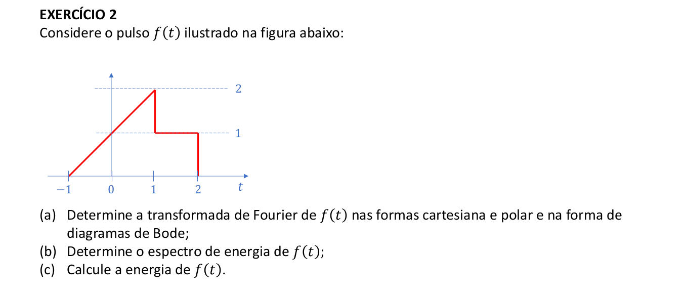

```{r setup, include=FALSE}
knitr::opts_chunk$set(echo = TRUE)
```




### Item (a)

A transformada $F(\omega)$ de $f(t)$ na sua forma cartesiana é 

$$
\begin{eqnarray}
F(\omega) & = & \int_{-1}^1 (1+t)e^{-i\omega t} + \int_1^21e^{-i\omega t} = \\
  & = & \frac{\sin(\omega) + \sin(2\omega)}{\omega} + i\frac{\cos(\omega) + \cos(2\omega) - \frac{2}{\omega}\sin(\omega)}{\omega}\\
\end{eqnarray}
$$

logo,

$$
\begin{eqnarray}
A(\omega) & = & \frac{\sin(\omega) + \sin(2\omega)}{\omega}\\
B(\omega) & = & \frac{\cos(\omega) + \cos(2\omega) - \frac{2}{\omega}\sin(\omega)}{\omega}\\
\end{eqnarray}
$$

Assim, já que a forma polar de $F(\omega) = |F(\omega)|e^{i\theta(\omega)}$ com 

$$
\begin{eqnarray}
|F(\omega)| &=& \sqrt{A(\omega)^2 + B(\omega)^2} \\
\theta(\omega) &=& \tan^{-1}\bigg(\frac{B(\omega)}{A(\omega)}\bigg)\\
\end{eqnarray}
$$
Tem-se,

$$
\begin{eqnarray}
|F(\omega)| & = & \frac{\sqrt{2\big[1 - \cos(2\omega)+ \omega[\sin(\omega) - \sin(2\omega) - \sin(3\omega)] + \omega^2[1 + \cos(\omega)]\big]}}{w^2}\\
\theta(\omega) & = & \tan^{-1}\bigg(\frac{\cos(\omega) + \cos(2\omega) - \frac{2}{\omega}\sin(\omega)}{\sin(\omega) + \sin(2\omega)}\bigg)\\
\end{eqnarray}
$$


#### diagramas de Bode

```{r}
A <- function(w) (sin(w) + sin(2*w))/w
B <- function(w) (cos(w) + cos(2*w) - (2/w)*sin(w))/w
Mod_F <- function(w) sqrt(A(w)^2 + B(w)^2)
theta <- function(w) atan(B(w)/A(w))
```


```{r}
w <- seq(0.1, 10, l = 100000)
plot(log10(w), 20*log10(Mod_F(w)), type = "l", main = "Freq vs Magnitude (escala log-log)")
plot(log10(w), theta(w), type = "l", main = "Freq vs Fase (escala log-linear)")
```


### Item (b)

O espectro de energia é definido como $E(\omega) = \frac{1}{2\pi}|F(\omega)|^2$.

```{r}
w <- seq(-10, 10, l = 100000)
E <- function(w) (1/(2*pi)) * Mod_F(w)^2
plot((w), E(w), type = "l", main = "Freq vs Espectro de Energia")
```


### Item (c)

A energia de $f(t)$ é $E = \int_{\omega = -\infty}^{\infty}E(\omega)d\omega \approx 3.665$

```{r}
safe_E <- function(w) {
  r <- E(w)
  ifelse(is.finite(r), r, 0)
}
integrate(safe_E, -500, 500)
```

