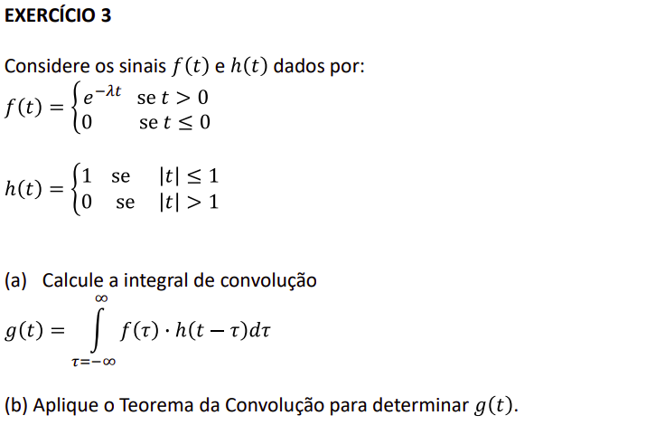
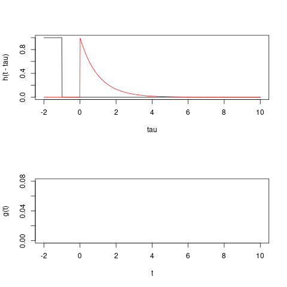

```{r setup, include=FALSE}
knitr::opts_chunk$set(echo = TRUE)
```





```{r, fig.height=3}
f <- function(t, l = 1) (t>0)*exp(-t*l)
h <- function(t) as.numeric(abs(t) < 1)
g <- function(t, tau = seq(-2,10,l=1000)) mean(f(tau) * h(t-tau))

tau <- seq(-2,10,l=1000)
plot(tau, h(tau), type = "l", ylab = "h(tau) - red; f(tau) - black")
lines(tau, f(tau), col = "red")
```

### Item (a)

Se $t \lt -1$

<script type="text/x-mathjax-config">
MathJax.Hub.Register.StartupHook("TeX Jax Ready",function () {
  MathJax.Hub.Insert(MathJax.InputJax.TeX.Definitions.macros,{
    cancel: ["Extension","cancel"],
    bcancel: ["Extension","cancel"],
    xcancel: ["Extension","cancel"],
    cancelto: ["Extension","cancel"]
  });
});
</script>

$$
\begin{eqnarray}
g(t) & = & \int_{-\infty}^{\infty}f(\tau)h(t - \tau)d\tau = \\
     & = & \int_{-\infty}^{0}0h(t - \tau)d\tau  + \int_{0}^{\infty}f(\tau)0d\tau = 0\\
\end{eqnarray}
$$

Se $-1 \le t \le 1$ 

$$
\begin{eqnarray}
g(t) & = & \int_{-\infty}^{\infty}f(\tau)h(t - \tau)d\tau = \\
     & = & \cancel{\int_{t-1}^{0}e^{-\lambda\tau}0d\tau}  + \int_{0}^{t+1}e^{-\lambda\tau}1d\tau = \\
     & = & \frac{-e^{-\lambda\tau}}{\lambda}\bigg\rvert_{0}^{t+1} = \frac{1 - e^{-\lambda(t+1)}}{\lambda}\\
\end{eqnarray}
$$

Se $t \gt 1$ 

$$
\begin{eqnarray}
g(t) & = & \int_{-\infty}^{\infty}f(\tau)h(t - \tau)d\tau = \\
     & = & \int_{t-1}^{t+1}e^{-\lambda\tau}d\tau = \\
     & = & \frac{-e^{-\lambda\tau}}{\lambda}\bigg\rvert_{t-1}^{t+1} = \frac{-e^{-\lambda\tau}}{\lambda}\bigg\rvert_{0}^{t+1} = \frac{e^{-\lambda(t-1)} - e^{-\lambda(t+1)}}{\lambda}\\
\end{eqnarray}
$$


```{r}
ts  <- seq(-2,10,l=100)
g <- function(t, l = 1) {
  dplyr::case_when(
    t < -1 ~ 0,
    t < 1 ~ (1 - exp(-l*(t+1)))/l,
    t >= 1 ~ (exp(-l*(t-1)) - exp(-l*(t+1)))/l
  )
}

plot(ts, g(ts), type = "l")
```


### Item (b)

Seja $F(\omega)$ e $H(\omega)$ as respectivas trasnformadas de Fourier de $f(t)$ e $h(t)$ respectivamente. 

$$
\begin{eqnarray}
F(\omega) & = & \int_{0}^{\infty}e^{-\lambda \tau} e^{-i 2 \pi  \omega \tau} d\tau = \frac{1}{\lambda + 2i\pi\omega}\\
H(\omega) & = & \int_{-1}^{1} e^{-i 2 \pi  \omega \tau} d\tau = \frac{\sin(2\pi\omega)}{\pi \omega}\\
\end{eqnarray}
$$

O teorema da convolução garante que 

$$
\mathcal{F} \big\{g(t)\big\} = \mathcal{F} \Bigg\{ \int_{-\infty}^{\infty}f(\tau)\cdot h(t - \tau)d\tau \Bigg\} = F(\omega)\cdot H(\omega) = \frac{1}{\lambda + 2i\pi\omega}\frac{\sin(2\pi\omega)}{\pi \omega}
$$

Agora aplicamos a transformada de Fourier inversa para retomarmos $g(t)$

$$
\begin{eqnarray}
g(t) &=& \mathcal{F}^{-1}\big\{\mathcal{F}\{g(t)\}\big\} = \mathcal{F}^{-1}\Bigg\{\frac{1}{\lambda + 2i\pi\omega}\frac{\sin(2\pi\omega)}{\pi \omega}\Bigg\} = \\
&=& \int_{-\infty}^{\infty}\\
\end{eqnarray}
$$


### Extra - GIF da convolução

{width="400"}

```{r, eval=FALSE, echo = TRUE}
## Código pra gerar o gif
animation::saveGIF({
  f <- function(t, l = 1) (t>0)*exp(-t*l)
  h <- function(t) as.numeric(abs(t) < 1)
  g <- function(t, tau = seq(-2,10,l=1000)) sapply(t, function(t) mean(f(tau) * h(t-tau)))

  par(mfrow = c(2,1))
  tau <- seq(-2,10,l=1000)
  ts  <- seq(-2,10,l=100)
  gs <- c()

  for(t in ts) {
    plot(tau, h(t-tau), type = "l")
    lines(tau, f(tau), col = "red")
    
    gs <- c(gs, g(t))
    plot(ts[1:length(gs)], gs, 
         xlim = range(ts), ylim = c(0,0.08), 
         type = "l", xlab = "t", ylab = "g(t)")
    
    Sys.sleep(0.05)
  }
}, interval = 0.05)
```
