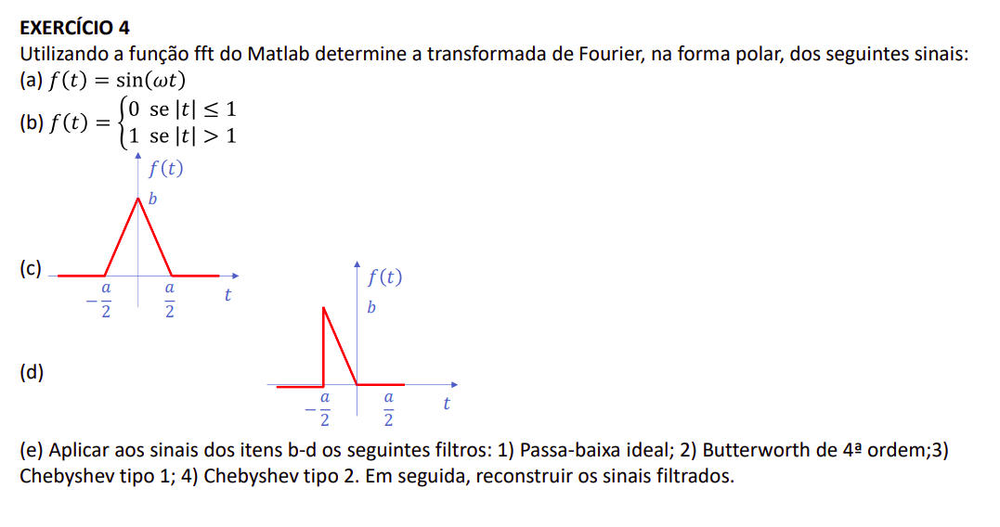

```{r setup, include=FALSE}
knitr::opts_chunk$set(echo = TRUE, message=FALSE, warning=FALSE)
```




```{r}
library(tidyverse)
fa <- function(t, w = 10) sin(t*w)
fb <- function(t) as.numeric(abs(t) < 1)
fc <- function(t, a=1, b=1) (abs(t) < a/2)*ifelse(t < 0, b + t*(2*b/a),  b + t*(-2*b/a))
fd <- function(t, a=1, b = 1) (t < 0)*(t > -a/2)*(-2*b/a)*t
t <- seq(-pi/2, pi/2, length = 44000)
```

## Sinais

```{r, code_folding=TRUE, echo = FALSE, fig.height=2}
fs_nested <- list(
  fa = fa(t)/2 + 0.5,
  fb = fb(t),
  fc = fc(t, a = 1),
  fd = fd(t, a = 1)
) %>%
  enframe(name = "f", value = "f_t") %>%
  mutate(
    fft_w = map(f_t, fft)
  )
  
fs <- fs_nested %>%
  unnest(c(f_t, fft_w)) %>%
  group_by(f) %>%
  mutate(
    t = t
  )

fs %>%
  ggplot() +
  geom_line(aes(x = t, y = f_t, colour = f), show.legend = FALSE, size = 0.5) +
  theme_void(20) +
  facet_wrap(~f)
```

```{r, echo=FALSE}
fs_nested <- list(
  fa = fa(t, w = 5000)/2 + 0.5,
  fb = fb(t),
  fc = fc(t, a = 1),
  fd = fd(t, a = 1)
) %>%
  enframe(name = "f", value = "f_t") %>%
  mutate(
    fft_w = map(f_t, fft)
  )

fs <- fs_nested %>%
  unnest(c(f_t, fft_w)) %>%
  group_by(f) %>%
  mutate(
    t = t
  )
```

## Espectros

```{r, code_folding=TRUE, echo = FALSE, fig.height=2}
fs %>%
  filter(t < quantile(t,probs = 0.01), t > quantile(t, probs = 0.001)) %>%
  ggplot() +
  geom_line(aes(x = t, y = log(Mod(fft_w)), colour = f), show.legend = FALSE, size = 0.4) +
  theme_void(20) +
  facet_wrap(~f, scales = "free_y")
```

## Fases

```{r, code_folding=TRUE, echo = FALSE, fig.height=2}
fs %>%
  filter(t > quantile(t, probs = 0.001)) %>%
  ggplot() +
  geom_line(aes(x = t, y = Arg(fft_w), colour = f), show.legend = FALSE, size = 0.4) +
  theme_void(20) +
  facet_wrap(~f, scales = "free_y")
```

## Filtros

```{r}
# Passa Baixa Ideal
h1 <- function(n = 44000, wc = 500)
  ifelse(abs(seq_len(n) - n/2) < n/2 - wc, 0, 1)

# Butterworth 
h2 <- function(n = 44000, wc = 500, nn = 4) {
  w <- abs(seq_len(n) - n/2)
  1/(1 + (w/wc)^nn)
}

# Auxiliar para Chebychev
Tn <- function(w, wc = 500, nn = 1) {
  wwc <- w/wc
  ifelse(w < wc, 
         cos(nn*acos(wwc)), 
         ((wwc*sqrt(wwc^2 - 1))^nn + (wwc*sqrt(wwc^2 - 1))^(-nn))/2)
}

# Chebychev Tipo 1
h3 <- function(n = 44000, wc = 500, nn = 4, e = 1) {
  w <- seq_len(n/2)
  w <- c(w, w[length(w):1])
  f <- 1/sqrt(1 + e^2 * Tn(w, wc, nn)^2)
  
  ifelse(is.nan(f), 0, f)
}

# Chebychev Tipo 2
h4 <- function(n = 44000, wc = 500, nn = 4, e = 1) {
  w <- seq_len(n/2)
  w <- c(w, w[length(w):1])
  f <- 1/sqrt(1 + 1/(e^2 * Tn(w, wc, nn)^2))
  
  ifelse(is.nan(f), 0, f)
}
```


```{r}
n <- length(t)
fs_nested <- list(
  fa = fa(t)/2 + 0.5,
  fb = fb(t),
  fc = fc(t, a = 1),
  fd = fd(t, a = 1)
) %>%
  enframe(name = "f", value = "f_t") %>%
  mutate(
    fft_w = map(f_t, fft),
    passa_baixa = map(fft_w, ~.x*h1(n)),
    butterworth_4a_ordem = map(fft_w, ~.x*h2(n)),
    chebchev_tipo_1 = map(fft_w, ~.x*h3(n)),
    chebchev_tipo_2 = map(fft_w, ~.x*h4(n))
  ) 

fs <- fs_nested %>%
  select(-fft_w, -f_t) %>%
  pivot_longer(-f, names_to = "filtro", values_to = "fft_w")
```

## Sinais reconstruídos

```{r, code_folding=TRUE, echo = FALSE, fig.height=3}
fs %>%
  unnest(c(fft_w)) %>%
  group_by(f, filtro) %>%
  mutate(
    t = t
  ) %>%
  filter(t > quantile(t, probs = 0.001)) %>%
  mutate(
    f_t = Re(fft(fft_w, inverse = TRUE))
  ) %>%
  ggplot(aes(linetype = filtro)) +
  geom_line(aes(x = t, y = f_t, colour = f), size = 0.4) +
  theme_void(20) +
  facet_wrap(~f, scales = "free_y")
```


