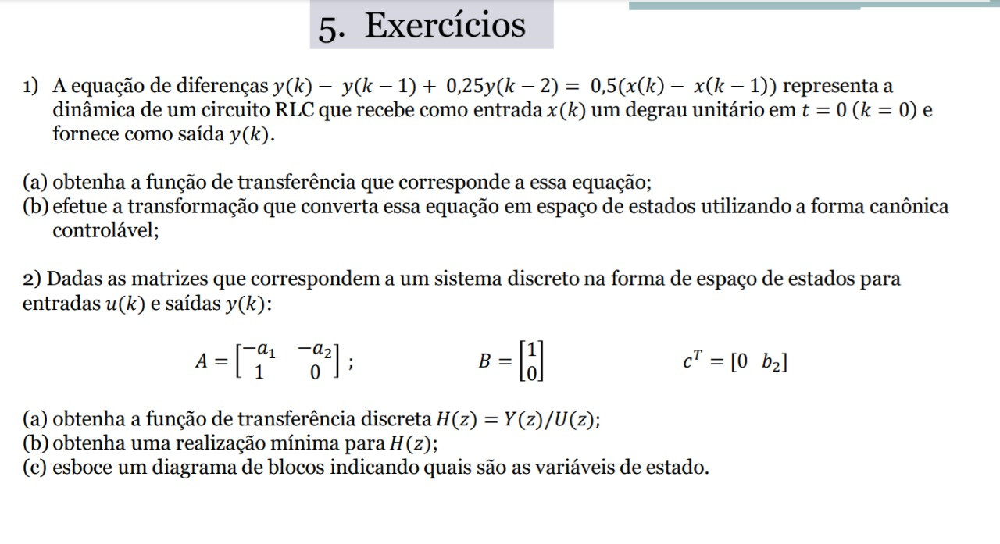
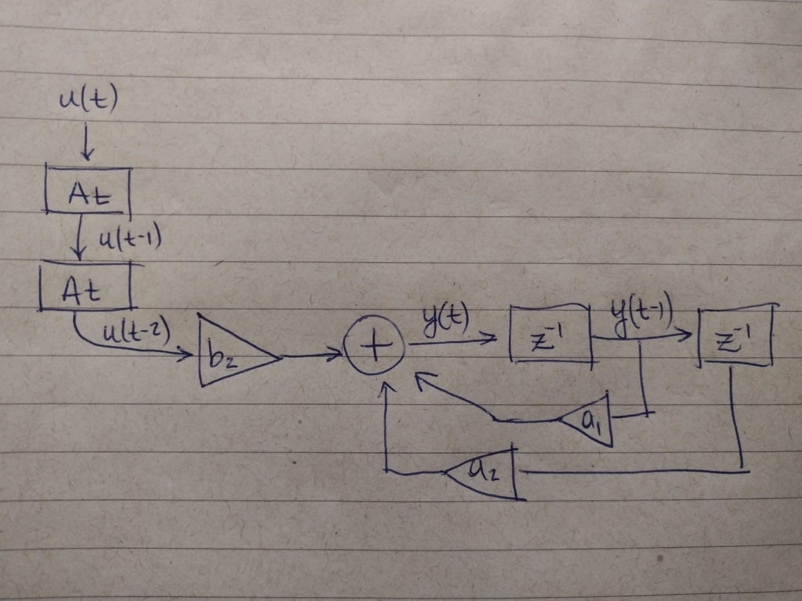

```{r setup, include=FALSE}
knitr::opts_chunk$set(echo = TRUE, message=FALSE, warning=FALSE)
```



## Exercício 1.a

Sejam $X(z)$ e $Y(z)$ as respectivas transformadas $Z$ de $x(t)$ e $y(t)$. Aplicando-se a transformada $Z$ em ambos os lados da equação de diferenças, temos:

```{=tex}
\begin{eqnarray}
Z[y(k) - y(k-1) + 0,25y(k-2)] & = & Z[0,5(x(k) - x(k-1))] \Rightarrow (\text{linearidade...})\\
Z[y(k)] - Z[y(k-1)] + 0,25Z[y(k-2)] & = & 0,5(Z[x(k)] - Z[x(k-1)]) \Rightarrow (\text{translação...})\\
Y(z) - z^{-1}Y(z) + 0,25z^{-2}Y(z) & = & 0,5(X(z) - z^{-1}X(z)) \Rightarrow (\text{fator comum...})\\
Y(z)(1 - z^{-1} + 0,25z^{-2}) & = & X(z)0,5(1 - z^{-1}) \\
\end{eqnarray}
```
Prosseguindo para a forma da função de transferência, temos:

$$
\begin{aligned}
\frac{Y(z)}{X(z)}  &=&  \frac{0,5(1 - z^{-1})}{(1 - z^{-1} + 0,25z^{-2})} = \frac{0,5(1 - z^{-1})}{(1 - z^{-1} + 0,25z^{-2})} \frac{z^2}{z^2} &=& \frac{0,5z^2 - 0,5z}{z^2 - z + 0,25}
\end{aligned}
$$

## Exercício 1.b

Do exercício anterior, extrai-se os coeficientes $n = 2$, $b_0 = 0,5$, $b_1 = -0,5$, $b_2 = 0$, $a_1 = -1$, $a_2 = 0,25$. Assim, o modelo em espaço de estado será:

```{=tex}
\begin{eqnarray}
\begin{bmatrix}
x(k+1) \\
x(k)
\end{bmatrix} &=& 
\begin{bmatrix}
0 & 1 \\
1 & -0,25
\end{bmatrix} 
\begin{bmatrix}
x(k) \\
x(k-1)
\end{bmatrix} + 
\begin{bmatrix}
0 \\
1
\end{bmatrix} u(k)
\end{eqnarray}
```
$$
\begin{aligned}
y(k) &=& \begin{bmatrix} - 0,125  & 0 \end{bmatrix} \begin{bmatrix} x(k) \\ x(k-1) \end{bmatrix} +  u(k)
\end{aligned}
$$

## Exercício 2.a

Os coeficientes são: $n = 2$, $b_0 = 0$, $b_1 = 0$, $b_2 = b_2$, $a_1 = a_1$, $a_2 = a_2$. Assim, a função de transferência será:

```{=tex}
\begin{eqnarray}
\frac{Y(z)}{U(z)}  &=&  \frac{b_0z^2 + b_1z + b2}{z^2 + a_1z + a2} = \frac{b2}{z^2 + a_1z + a2}\\ 
\end{eqnarray}
```
## Exercício 2.b

## Exercício 2.c

{width="583"}
